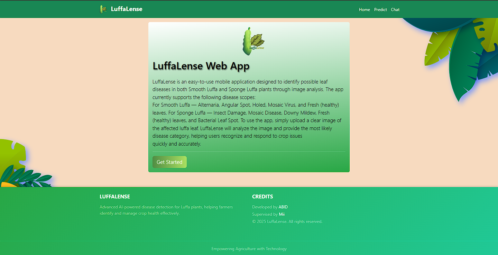
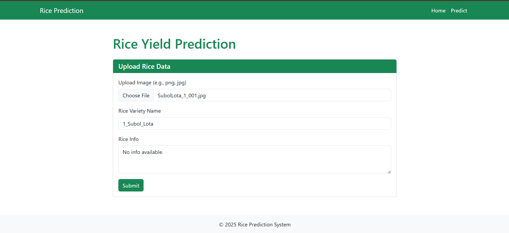
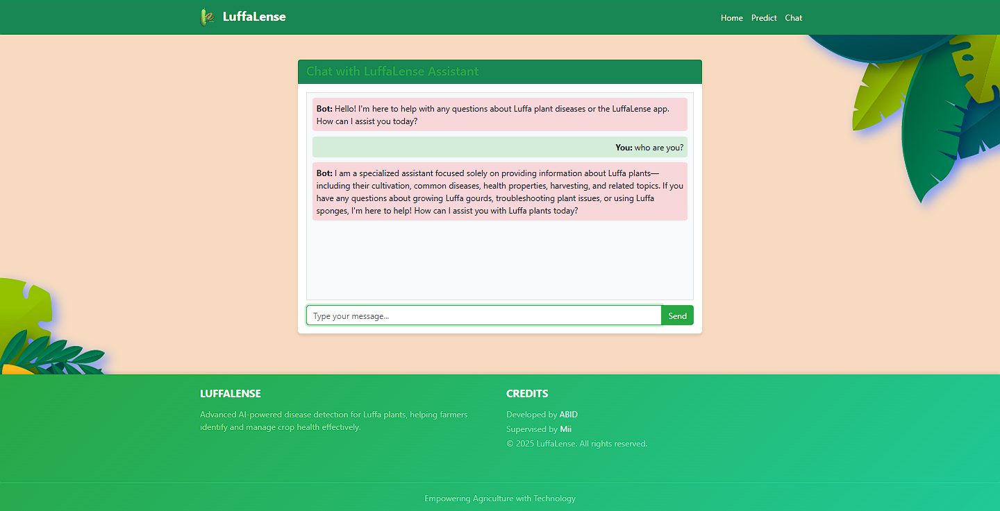

# LuffaLense

## Project Summary

LuffaLense is a comprehensive web-based application for Luffa plant disease management and information. The platform combines advanced deep learning technology for disease classification with an AI-powered chat assistant specialized in Luffa plant knowledge.

**Key Features:**
- **Disease Classification**: AI-powered image analysis for identifying Luffa plant diseases
- **AI Chat Assistant**: Specialized chatbot providing expert knowledge on Luffa cultivation, diseases, and care
- **Dual Luffa Support**: Separate models for Smooth Luffa and Sponge Luffa varieties
- **Real-time Analysis**: Instant disease detection with detailed information
- **Expert Guidance**: 24/7 access to Luffa plant expertise through AI assistant

Built with Django as the backend framework, the system uses an ensemble approach combining multiple pre-trained convolutional neural networks (MobileNetV2, VGG16, NASNetMobile) with XGBoost as a meta-learner for accurate disease classification. The AI chat assistant leverages OpenRouter API with DeepSeek models to provide specialized Luffa plant information.

## Screenshots

### Home Page


### Before Prediction


### After Prediction


### Chat Assistant


## Components Used

The LuffaLense system is composed of several key components with their usage details:

- **Backend Framework**: Django 5.x - Handles server-side logic, routing, and API endpoints
- **Machine Learning API**: Hugging Face Spaces API - External API for disease prediction using pre-trained models
- **Image Processing**: PIL/Pillow - Library for image manipulation and preprocessing
- **Database**: SQLite (development) / PostgreSQL (production) - Used as the default database for storing application data
- **Frontend Technologies**:
  - HTML5 - Markup for structuring web pages
  - CSS3 - Styling for responsive and user-friendly design
  - JavaScript - Adds client-side interactivity and dynamic content
- **Web Server**: Django's built-in development server for development; Gunicorn for production deployment
- **API Integration**: Requests library for HTTP communication with Hugging Face API

## 🚀 Features

### Web Application
- **Image Upload**: Users can upload Luffa leaf images for disease classification
- **Real-time Prediction**: Instant disease classification using ensemble ML models
- **Two Luffa Types**: Supports classification for both Smooth Luffa and Sponge Luffa varieties
- **Disease Information**: Provides detailed information about detected diseases
- **AI Chat Assistant**: Specialized chatbot for Luffa plant questions and guidance
- **Responsive Design**: Works on desktop and mobile devices
- **REST API**: Provides API endpoints for disease prediction and chat functionality

### AI Chat Assistant
- **Specialized Knowledge**: Expert information on Luffa cultivation, diseases, and care
- **24/7 Availability**: Always accessible AI assistant for plant-related queries
- **Topic Restriction**: Focused exclusively on Luffa plants and related topics
- **Plain Text Responses**: Clean, readable responses without formatting
- **Real-time Interaction**: Instant responses powered by DeepSeek AI models

## Installation

### Web Application

1. Clone the repository:
```bash
git clone <repository-url>
cd Luffa_Prediction
```

2. Create and activate virtual environment:
```bash
python -m venv .venv
.venv\Scripts\activate  # On Windows
# or
source .venv/bin/activate  # On macOS/Linux
```

3. Install dependencies:
```bash
pip install -r requirements.txt
```

4. Run migrations:
```bash
python manage.py migrate
```

5. Start the development server:
```bash
python manage.py runserver
```

## Usage

### Web

1. Open your browser and navigate to `http://localhost:8000`
2. Click on "Get Started" to go to the prediction page
3. Select the Luffa type (Smooth or Sponge)
4. Upload a clear image of the Luffa leaf
5. View the classification results with disease information

## API Information

### Disease Classification API
- **API Endpoint**: Hugging Face Spaces API (https://Abid1012-luffa-disease-api.hf.space/predict/image)
- **Architecture**: Ensemble of CNN models (MobileNetV2, VGG16, NASNetMobile) with XGBoost meta-learner hosted externally
- **Training Dataset**: Luffa leaf images with various disease conditions
- **Model Types**: Separate models for Smooth Luffa and Sponge Luffa
- **Request Format**: POST with multipart/form-data containing image file and category parameter
- **Response Format**: JSON with prediction, category, and status

### AI Chat API
- **API Provider**: OpenRouter API (https://openrouter.ai/api/v1)
- **AI Model**: DeepSeek R1 (deepseek/deepseek-r1-0528:free)
- **Specialization**: Luffa plant information and cultivation
- **Request Format**: POST with JSON payload containing user message
- **Response Format**: JSON with status and AI-generated response
- **Features**: Topic restriction to Luffa plants, plain text responses

## Supported Diseases

### Smooth Luffa
- **Alternaria**: Fungal disease causing dark spots on leaves
- **Angular Spot**: Bacterial disease with angular water-soaked lesions
- **Fresh**: Healthy leaves with no visible disease signs
- **Holed**: Physical damage or insect holes in leaves
- **Mosaic Virus**: Viral disease causing mottled patterns
- **Others**: Unidentified diseases or conditions

### Sponge Luffa
- **Bacteria Leaf Spot**: Small, dark lesions with yellow halos
- **Downy Mildew**: White or gray patches on leaf undersides
- **Fresh**: Healthy leaves with no visible disease signs
- **Insect**: Signs of insect damage (holes, chewing marks)
- **Mosaic disease**: Irregular patterns and discoloration
- **Others**: Unidentified diseases or conditions

## Technical Stack

- **Backend**: Django 5.x, Django REST Framework
- **Frontend**: HTML5, CSS3, JavaScript, Bootstrap 5
- **ML API**: Hugging Face Spaces API
- **AI Chat API**: OpenRouter API with DeepSeek models
- **Image Processing**: PIL/Pillow
- **Database**: SQLite (dev) / PostgreSQL (prod)
- **Deployment**: Render, Gunicorn

## Project Structure

```
Luffa_Prediction/
├── rice_prediction/          # Django project settings
├── prediction/               # Main app for disease classification
│   ├── views.py             # Prediction logic and views
│   ├── models.py            # Database models (if any)
│   ├── urls.py              # URL configurations
│   └── ...
├── templates/               # HTML templates
│   └── prediction/
│       ├── home.html        # Home page template
│       ├── predict.html     # Prediction page template
│       └── chat.html        # Chat assistant page template
├── static/                  # CSS, JS, images
│   ├── css/
│   │   └── style.css        # Custom styles
│   └── asset/               # Images and assets
├── model/                   # ML models
│   ├── Luffa_Smooth/        # Smooth Luffa models
│   └── Luffa Spoonge/       # Sponge Luffa models
├── tflite/                  # Converted TFLite models
├── media/                   # User uploaded images
├── requirements.txt         # Python dependencies
├── manage.py                # Django management script
├── convert_luffa_models.py  # TFLite conversion script
├── Procfile                 # Heroku/Render deployment
├── render.yaml              # Render deployment config
└── README.md
```

## Development

### Converting Models to TFLite

To convert Keras models to TensorFlow Lite format for mobile deployment:

```bash
python convert_luffa_models.py
```

This will convert all models in the `model/` directory and save them in the `tflite/` directory.

### Running Tests
```bash
python manage.py test prediction
```

### Adding New Diseases or Luffa Types
To add support for new diseases or Luffa varieties:
1. Collect and label new training data
2. Retrain the CNN models and XGBoost meta-learner
3. Update the class labels in `prediction/views.py`
4. Add disease information to the hardcoded dictionary
5. Update the frontend if needed

## Deployment

### Render Deployment

The application is configured for deployment on Render with:
- Web service using Gunicorn
- PostgreSQL database
- Static files served via WhiteNoise
- Environment variables for configuration

### Local Production Setup

For production deployment locally:

```bash
pip install gunicorn
gunicorn rice_prediction.wsgi:application --bind 0.0.0.0:8000
```

## Contributing

1. Fork the repository
2. Create a feature branch (`git checkout -b feature/new-feature`)
3. Commit your changes (`git commit -am 'Add new feature'`)
4. Push to the branch (`git push origin feature/new-feature`)
5. Create a Pull Request

## License

This project is open source and available under the [MIT License](LICENSE).

## Credits

- **Developed by**: ABID
- **Supervised by**: [Mii](https://annex.bubt.edu.bd/mii/?chapter=profile)
- **© 2025 LuffaLense. All rights reserved.**
