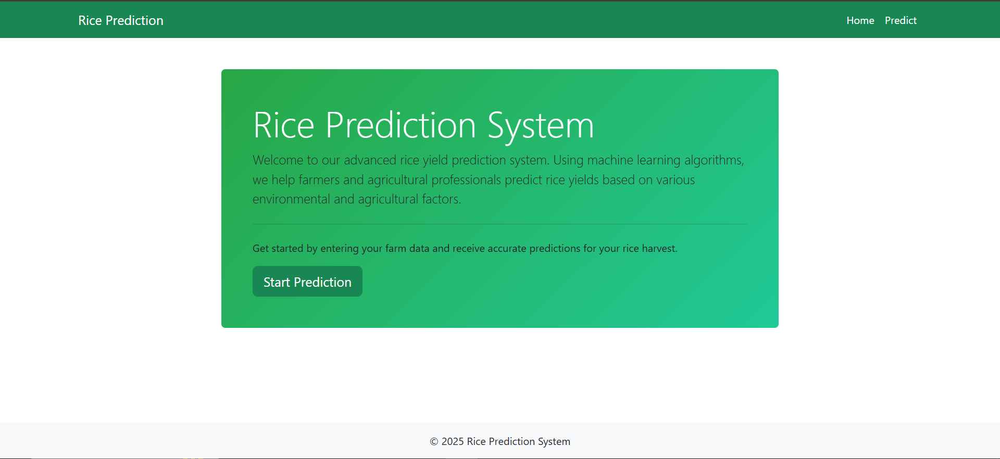
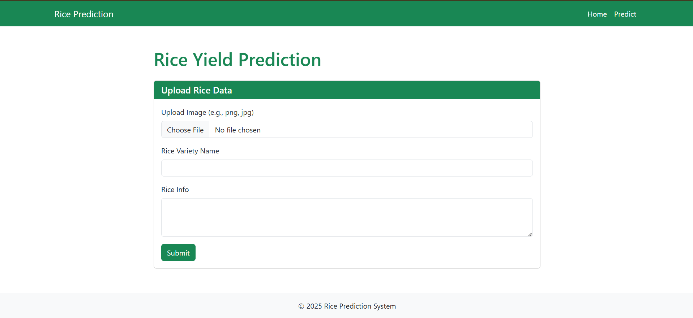

# LuffaLense

## Project Summary

LuffaLense is a web-based application that leverages deep learning technology to accurately classify diseases in Luffa plants. Built with Django as the backend framework, it provides an intuitive user interface for uploading Luffa leaf images and receiving instant disease classification results. The system uses an ensemble approach combining multiple pre-trained convolutional neural networks (MobileNetV2, VGG16, NASNetMobile) with XGBoost as a meta-learner to analyze images and predict disease types with high confidence scores. This tool is designed for farmers, agricultural professionals, and researchers to quickly identify and manage Luffa plant diseases, supporting applications in crop health monitoring and disease management.

## Screenshots

### Home Page


### Before Prediction


### After Prediction


## Components Used

The LuffaLense system is composed of several key components with their usage details:

- **Backend Framework**: Django 5.x - Handles server-side logic, routing, and API endpoints
- **Machine Learning API**: Hugging Face Spaces API - External API for disease prediction using pre-trained models
- **Image Processing**: PIL/Pillow - Library for image manipulation and preprocessing
- **Database**: SQLite (development) / PostgreSQL (production) - Used as the default database for storing application data
- **Frontend Technologies**:
  - HTML5 - Markup for structuring web pages
  - CSS3 - Styling for responsive and user-friendly design
  - JavaScript - Adds client-side interactivity and dynamic content
- **Web Server**: Django's built-in development server for development; Gunicorn for production deployment
- **API Integration**: Requests library for HTTP communication with Hugging Face API

## 🚀 Features

### Web Application
- **Image Upload**: Users can upload Luffa leaf images for disease classification
- **Real-time Prediction**: Instant disease classification using ensemble ML models
- **Two Luffa Types**: Supports classification for both Smooth Luffa and Sponge Luffa varieties
- **Disease Information**: Provides detailed information about detected diseases
- **Responsive Design**: Works on desktop and mobile devices
- **REST API**: Provides API endpoints for potential integrations

## Installation

### Web Application

1. Clone the repository:
```bash
git clone <repository-url>
cd Luffa_Prediction
```

2. Create and activate virtual environment:
```bash
python -m venv .venv
.venv\Scripts\activate  # On Windows
# or
source .venv/bin/activate  # On macOS/Linux
```

3. Install dependencies:
```bash
pip install -r requirements.txt
```

4. Run migrations:
```bash
python manage.py migrate
```

5. Start the development server:
```bash
python manage.py runserver
```

## Usage

### Web

1. Open your browser and navigate to `http://localhost:8000`
2. Click on "Get Started" to go to the prediction page
3. Select the Luffa type (Smooth or Sponge)
4. Upload a clear image of the Luffa leaf
5. View the classification results with disease information

## API Information

- **API Endpoint**: Hugging Face Spaces API (https://Abid1012-luffa-disease-api.hf.space/predict/image)
- **Architecture**: Ensemble of CNN models (MobileNetV2, VGG16, NASNetMobile) with XGBoost meta-learner hosted externally
- **Training Dataset**: Luffa leaf images with various disease conditions
- **Model Types**: Separate models for Smooth Luffa and Sponge Luffa
- **Request Format**: POST with multipart/form-data containing image file and category parameter
- **Response Format**: JSON with prediction, category, and status

## Supported Diseases

### Smooth Luffa
- **Alternaria**: Fungal disease causing dark spots on leaves
- **Angular Spot**: Bacterial disease with angular water-soaked lesions
- **Fresh**: Healthy leaves with no visible disease signs
- **Holed**: Physical damage or insect holes in leaves
- **Mosaic Virus**: Viral disease causing mottled patterns
- **Others**: Unidentified diseases or conditions

### Sponge Luffa
- **Bacteria Leaf Spot**: Small, dark lesions with yellow halos
- **Downy Mildew**: White or gray patches on leaf undersides
- **Fresh**: Healthy leaves with no visible disease signs
- **Insect**: Signs of insect damage (holes, chewing marks)
- **Mosaic disease**: Irregular patterns and discoloration
- **Others**: Unidentified diseases or conditions

## Technical Stack

- **Backend**: Django 5.x, Django REST Framework
- **Frontend**: HTML5, CSS3, JavaScript, Bootstrap 5
- **ML API**: Hugging Face Spaces API
- **Image Processing**: PIL/Pillow
- **Database**: SQLite (dev) / PostgreSQL (prod)
- **Deployment**: Render, Gunicorn

## Project Structure

```
Luffa_Prediction/
├── rice_prediction/          # Django project settings
├── prediction/               # Main app for disease classification
│   ├── views.py             # Prediction logic and views
│   ├── models.py            # Database models (if any)
│   ├── urls.py              # URL configurations
│   └── ...
├── templates/               # HTML templates
│   └── prediction/
│       ├── home.html        # Home page template
│       └── predict.html     # Prediction page template
├── static/                  # CSS, JS, images
│   ├── css/
│   │   └── style.css        # Custom styles
│   └── asset/               # Images and assets
├── model/                   # ML models
│   ├── Luffa_Smooth/        # Smooth Luffa models
│   └── Luffa Spoonge/       # Sponge Luffa models
├── tflite/                  # Converted TFLite models
├── media/                   # User uploaded images
├── requirements.txt         # Python dependencies
├── manage.py                # Django management script
├── convert_luffa_models.py  # TFLite conversion script
├── Procfile                 # Heroku/Render deployment
├── render.yaml              # Render deployment config
└── README.md
```

## Development

### Converting Models to TFLite

To convert Keras models to TensorFlow Lite format for mobile deployment:

```bash
python convert_luffa_models.py
```

This will convert all models in the `model/` directory and save them in the `tflite/` directory.

### Running Tests
```bash
python manage.py test prediction
```

### Adding New Diseases or Luffa Types
To add support for new diseases or Luffa varieties:
1. Collect and label new training data
2. Retrain the CNN models and XGBoost meta-learner
3. Update the class labels in `prediction/views.py`
4. Add disease information to the hardcoded dictionary
5. Update the frontend if needed

## Deployment

### Render Deployment

The application is configured for deployment on Render with:
- Web service using Gunicorn
- PostgreSQL database
- Static files served via WhiteNoise
- Environment variables for configuration

### Local Production Setup

For production deployment locally:

```bash
pip install gunicorn
gunicorn rice_prediction.wsgi:application --bind 0.0.0.0:8000
```

## Contributing

1. Fork the repository
2. Create a feature branch (`git checkout -b feature/new-feature`)
3. Commit your changes (`git commit -am 'Add new feature'`)
4. Push to the branch (`git push origin feature/new-feature`)
5. Create a Pull Request

## License

This project is open source and available under the [MIT License](LICENSE).

## Credits

- **Developed by**: ABID
- **Supervised by**: [Mii](https://annex.bubt.edu.bd/mii/?chapter=profile)
- **© 2025 LuffaLense. All rights reserved.**
